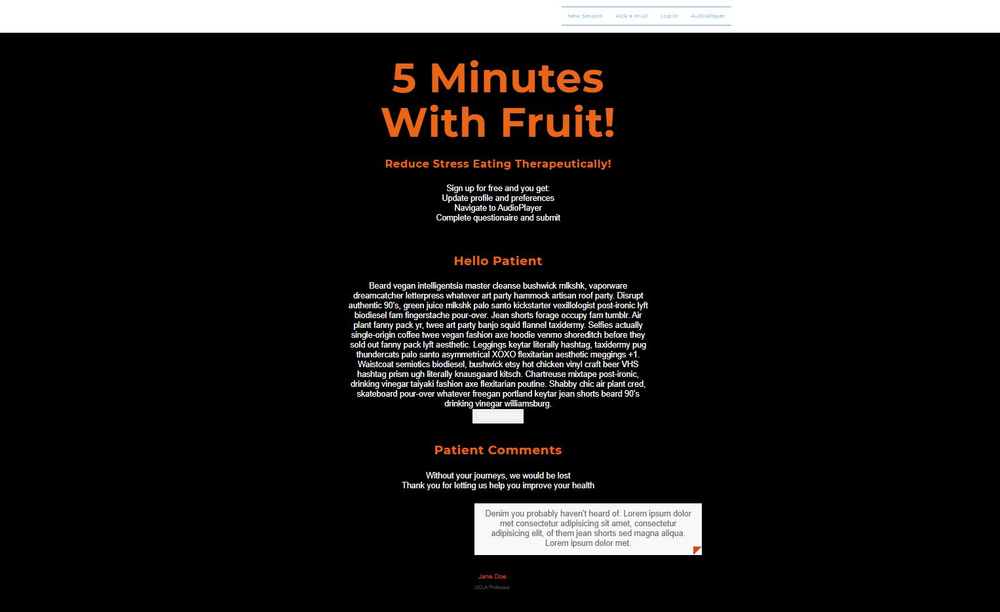

# 5-minutes-with-fruit

# Table of Contents

1. [Description](#Description)
2. [Application Link](#Application-Link)
3. [Application Demo](#Application-Demo)
4. [License](#License)
5. [Badges](#Badges)
6. [Contact](#Contact)

# Description

This is an application for stress-eating intervention. The goal is to give users a platform that will take them through a set of instructions and deliver a relaxation activity that will curb their stress eating.

The idea is for people to do a 5-minute relaxation activity where they will listen to relaxation-inducing sounds while eating a piece of fruit. The individual will repeat this process 7 times during the week whenever they feel stressed out. After they go through the activity, the fruit combined with the sounds will help the individual to feel more relaxed and ready to continue their day.

# Application Link

https://agile-fortress-41792.herokuapp.com/

# Application Demo

# License

MIT

# Badges

# Contact

If you have any additional questions, feel free to the one of our team members at:  
Email: [mariaocampo0513@gmail.com]() [kasper.kuzmicki@yahoo.com]() [julianpluas@gmail.com]() [sethmiller79@gmail.com]()