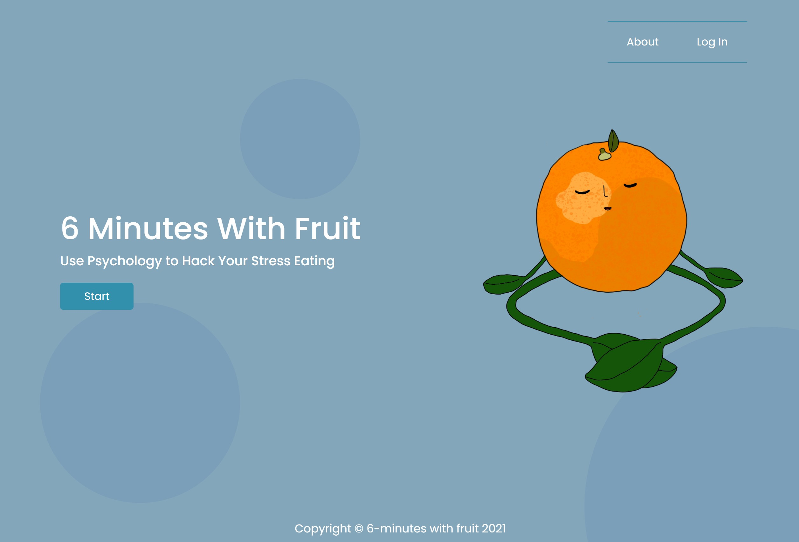

# 5-minutes-with-fruit

# Table of Contents

1. [Description](#Description)
2. [Prototype](#Prototype)
3. [Application Link](#Application-Link)
4. [Application Demo](#Application-Demo)
5. [License](#License)
6. [Badges](#Badges)
7. [Contact](#Contact)
8. [Notes](#Notes)

# Description

The goal of this application is to give users a platform that will take them through a set of instructions and deliver a relaxation activity that will curb their stress eating.

Users will listen to a relaxation activity and then follow instructions to eat a specific fruit. The individual will repeat this process 7 times during the week. After this period of time, the user will no longer need to listen to the relaxation activity. By only eating the fruit, the user will feel relaxed and will no longer feel the need to overeat when they feel stressed.

# Prototype
https://www.figma.com/proto/7JBk2izZaqmeGpFGw3NMdy/Meditation-With-Fruit?node-id=1%3A3&scaling=scale-down&page-id=0%3A1
# Application Link

https://meditationwithfruits.herokuapp.com/

# Application Demo

# License

MIT

# Badges

# Contact

If you have any additional questions, feel free to the one of our team members at:  
Email: [mariaocampo0513@gmail.com]() [kasper.kuzmicki@yahoo.com]() [julianpluas@gmail.com]() [sethmiller79@gmail.com]()

# Notes  
If you would like to see the first stages of the application, please visit https://github.com/kwaspek104/5_Minutes_With_Fruit
